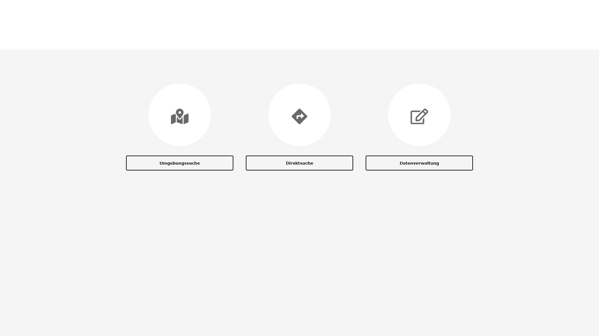
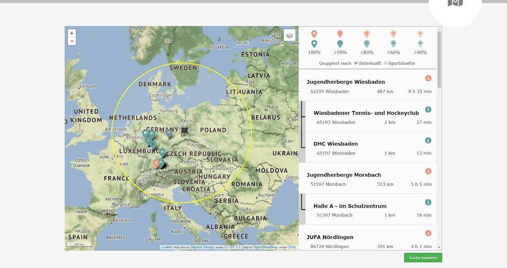
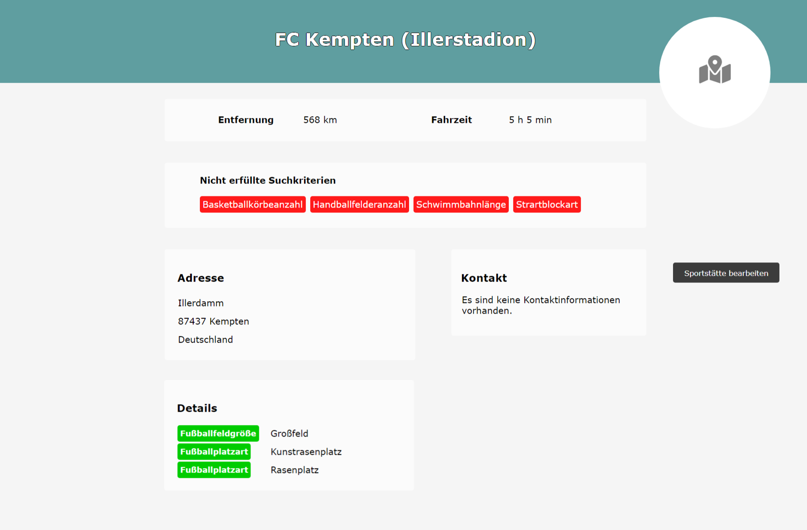
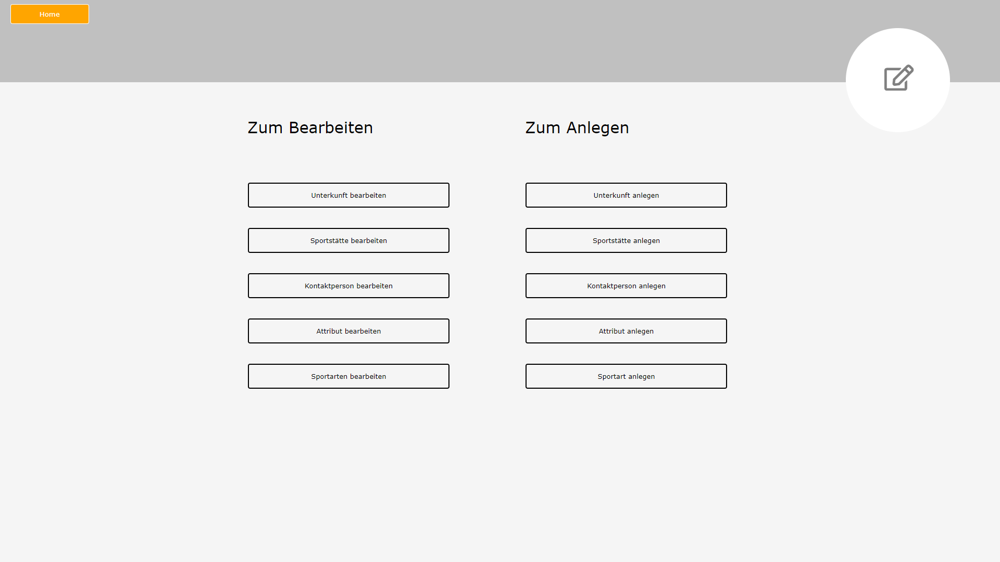
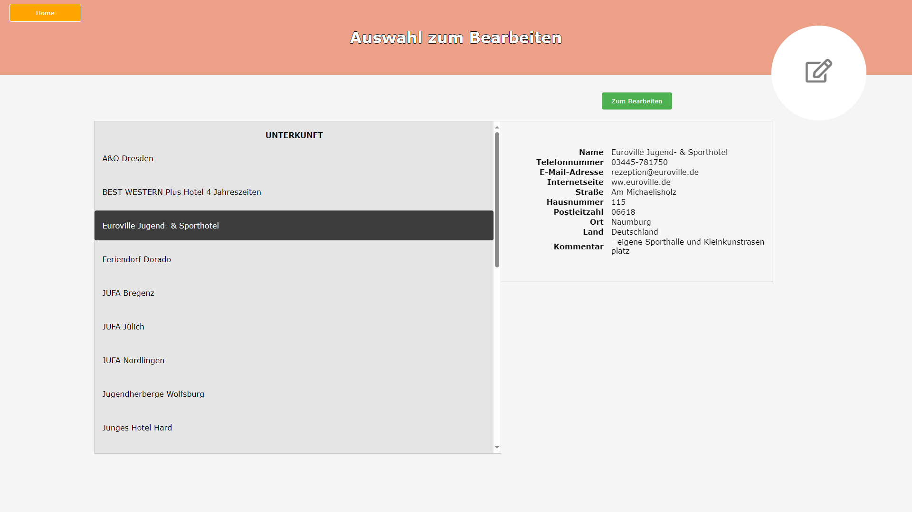
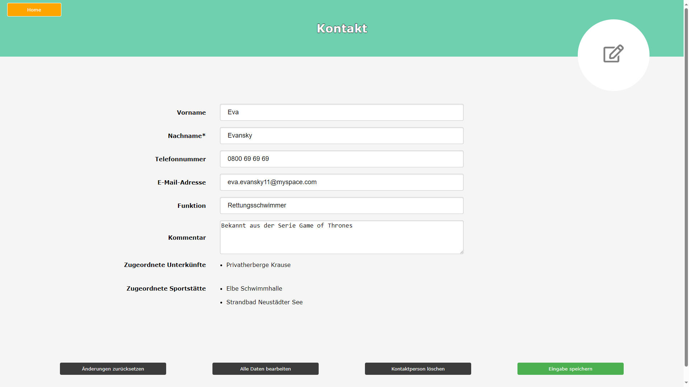
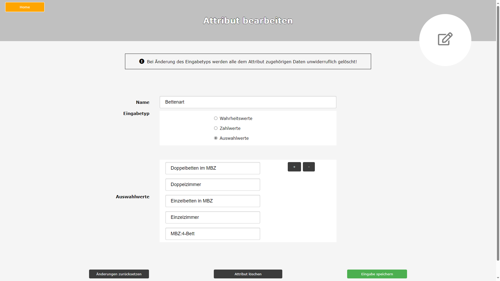

# TSC-Knowledge Management Software

This Knowledge Management Software was created as part of a project in collaboration with the Touristik-Service-Center GmbH. The small, tourism-oriented company organizes field trips and vacations for schools, youth organizations, and clubs.

This was the first effort the company made to digitalize their institutional knowledge and associated workflows. As part of this exercise, as little external code and/or libraries as possible were used, and instead a fresh, ground-up implementation of the source code was chosen.

The project was implemented on a local web server and database that allowed simultaneous and dispersed work on the data. As only a web browser is necessary to access the data, the software runs (and will run) independent of platform or operating system. The complete frontend and backend development was done during the project and only by participating students. The associated MySQL database schema was conceived and initialized, and the data handling and SQL logic were integrated in the backend. A UX and UI concept was developed, reviewed, and implemented.

 

Features that are included:
- Searching for sports facilities or lodging in a specific geographic location
- Searching for sports facilities or lodging with conditions (e.g., number of beds, number of football fields, etc.)
- Searching for both simultaneously: given a specific geographic location and a maximum distance perimeter, you can select possible combinations of lodging and facilities that meet the user's conditions
- Display search results on a (open-source) map as well as calculate the distances and estimate the travel time
- Tools for administration: data entry and data manipulation
    - Enter new lodgings, sports facilities, persons to contact, and also new attributes (with options for data type and possible values) and types of sports
    - Manipulate every possible datapoint without worrying about breaking the underlying data or errors at every point in the present or future

 
 

 

 

 

 

 

 

 

 
See /Screenshots for more visual impressions.
